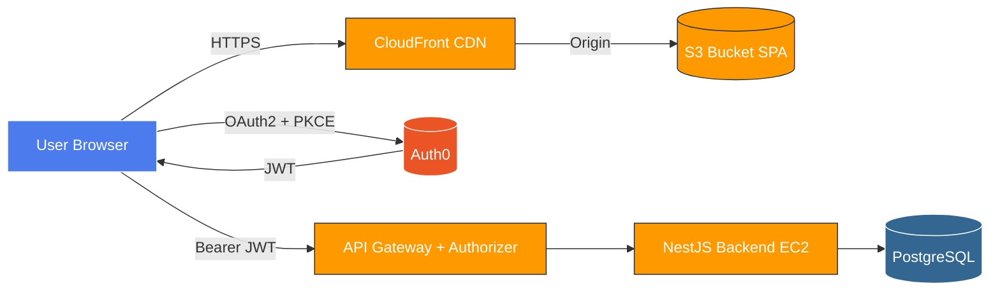

# CityExpress · Frontend G15

> SPA en **React + Vite (JavaScript puro)** que actúa como interfaz operativa del ecosistema **CityExpress** (curso IIC2173 — ArquiSoftware, 2026-1, Grupo 15). Consume la API NestJS protegida por AWS API Gateway y se autentica vía Auth0. Despliegue obligatorio en **AWS S3 + CloudFront** con HTTPS.

[](https://nodejs.org)
[](https://react.dev)
[](https://vitejs.dev)
[](./LICENSE)

---

## Índice

- [CityExpress · Frontend G15](#cityexpress--frontend-g15)
  - [Índice](#índice)
  - [1. Descripción](#1-descripción)
  - [2. Arquitectura](#2-arquitectura)
  - [3. Stack técnico](#3-stack-técnico)
  - [4. Requisitos previos](#4-requisitos-previos)
  - [5. Instalación local](#5-instalación-local)
  - [6. Scripts disponibles](#6-scripts-disponibles)
  - [7. Estructura de carpetas](#7-estructura-de-carpetas)
  - [8. Variables de entorno](#8-variables-de-entorno)
  - [9. Metodología y convenciones (IA Acordada)](#9-metodología-y-convenciones-ia-acordada)
    - [Gitflow estricto](#gitflow-estricto)
    - [Conventional Commits (en inglés)](#conventional-commits-en-inglés)
    - [Pull Request — descripción obligatoria](#pull-request--descripción-obligatoria)
    - [BMAD / GSD — artefactos obligatorios](#bmad--gsd--artefactos-obligatorios)
    - [IA / agentes](#ia--agentes)
  - [10. Diseño y UI/UX](#10-diseño-y-uiux)
    - [10.1 Stack visual](#101-stack-visual)
    - [10.2 Librerías recomendadas (no instaladas por defecto — agregar bajo demanda)](#102-librerías-recomendadas-no-instaladas-por-defecto--agregar-bajo-demanda)
    - [10.3 Diseño asistido](#103-diseño-asistido)
  - [11. Testing](#11-testing)
    - [Unit tests — Vitest + React Testing Library](#unit-tests--vitest--react-testing-library)
    - [E2E — Playwright](#e2e--playwright)
    - [CI gates](#ci-gates)
  - [12. Despliegue en AWS (RNF08)](#12-despliegue-en-aws-rnf08)
    - [12.1 Build local](#121-build-local)
    - [12.2 Crear bucket S3](#122-crear-bucket-s3)
    - [12.3 Subir el build](#123-subir-el-build)
    - [12.4 Crear distribución CloudFront](#124-crear-distribución-cloudfront)
    - [12.5 Invalidación post-deploy](#125-invalidación-post-deploy)
    - [12.6 GitHub Actions (resumen del workflow propuesto)](#126-github-actions-resumen-del-workflow-propuesto)
  - [13. Licencia](#13-licencia)
  - [14. Referencias](#14-referencias)

---

## 1. Descripción

CityExpress es un sistema distribuido de fulfillment de paquetes entre ciudades (curso ArquiSoftware). Este repositorio contiene **únicamente el frontend** del Grupo 15: una **Single Page Application** que permite al operador:

- **RF01** — Consultar paquetes recibidos (lista paginada con filtros).
- **RF02** — Visualizar el estado de conectividad/rutas a otras ciudades.
- **RF04** — Ejecutar la entrega final de un paquete respetando `deliverNotBefore`.
- **Auth (RNF06/07)** — Autenticarse vía Auth0 (JWT) para acceder a las vistas protegidas.

El backend correspondiente vive en `CityExpress-backendG15/` y es la **fuente de verdad** de los contratos API.

---

## 2. Arquitectura



**Capas internas (resumen):**
`pages` → `features/{packages,routes,auth}` → `hooks` → `services/api` → backend.
`providers/AuthProvider` envuelve la app y el `httpClient` (fetch (Web Platform)) inyecta el Bearer JWT.

> Documento completo en [`docs/architecture.md`](./docs/architecture.md) — incluye diagrama de capas, mapeo RF→componentes, NFR mapping y tradeoffs.

---

## 3. Stack técnico

| Categoría        | Tecnología                                                                       | Versión objetivo |
| ---------------- | -------------------------------------------------------------------------------- | ---------------- |
| Lenguaje         | JavaScript (ES2022+)                                                             | —                |
| Framework        | React                                                                            | 18+              |
| Build            | Vite                                                                             | 5+               |
| Routing          | React Router                                                                     | 6+               |
| HTTP             | **fetch nativo** envuelto en `httpClient.js` (sin axios)                         | —                |
| Auth             | `@auth0/auth0-react`                                                             | 2.x              |
| Estilos          | **Tailwind CSS v4** + `@tailwindcss/vite` (zero-config, theming via `@theme {}`) | 4.x              |
| UI primitives    | **Headless UI** (`@headlessui/react`)                                            | 2.x              |
| Iconos           | **Lucide React**                                                                 | última           |
| Toasts           | **Sonner**                                                                       | 1.x              |
| Utilidades CSS   | `clsx` + `tailwind-merge` (helper `cn()` en `src/lib/utils.js`)                  | —                |
| Fechas           | `date-fns` (para guard `deliverNotBefore`)                                       | 4.x              |
| Diseño asistido  | **Claude (visual reasoning)** + **Figma MCP** + tokens en `@theme {}`            | —                |
| Tests unit       | Vitest + React Testing Library + jsdom                                           | última           |
| Tests E2E        | Playwright                                                                       | última           |
| Lint/Format      | ESLint + Prettier + `eslint-plugin-jsx-a11y`                                     | última           |
| Containerización | Docker (multi-stage: node-alpine → nginx-alpine)                                 | —                |
| CI/CD            | GitHub Actions                                                                   | —                |
| CDN/Hosting      | AWS S3 + CloudFront + ACM                                                        | —                |
| APM              | New Relic Browser                                                                | —                |

> **No** se usa TypeScript en este repo (decisión del equipo G15). Tipado se documenta vía JSDoc cuando aporte.

---

## 4. Requisitos previos

- **Node.js ≥ 20** (recomendado vía [NVM](https://github.com/nvm-sh/nvm)).
- **pnpm ≥ 9** (`corepack enable && corepack prepare pnpm@latest --activate`).
- **Docker** + **docker compose** para parity con producción.
- **AWS CLI** v2 configurado (`aws configure`) con credenciales del entorno del curso.
- **Tenant Auth0** propio del equipo G15 con una **SPA Application** registrada y `audience` apuntando al API NestJS.

---

## 5. Instalación local

```bash
# 1. Clonar
git clone git@github.com:<org>/CityExpress-frontendG15.git
cd CityExpress-frontendG15

# 2. Instalar dependencias
pnpm install

# 3. Variables de entorno
cp .env.example .env.local
# editar .env.local con los valores de Auth0 y backend

# 4. Levantar dev server
pnpm dev
# → http://localhost:5173
```

---

## 6. Scripts disponibles

| Script               | Acción                                  |
| -------------------- | --------------------------------------- |
| `pnpm dev`           | Vite dev server con HMR                 |
| `pnpm build`         | Build de producción a `dist/`           |
| `pnpm preview`       | Sirve `dist/` localmente                |
| `pnpm test`          | Tests unitarios Vitest                  |
| `pnpm test:coverage` | Tests + reporte de coverage (gate ≥75%) |
| `pnpm e2e`           | Tests E2E Playwright                    |
| `pnpm lint`          | ESLint sobre `src/` y `e2e/`            |
| `pnpm format`        | Prettier write                          |

---

## 7. Estructura de carpetas

```
CityExpress-frontendG15/
├── docs/
│   ├── roadmap.md
│   ├── milestones.md
│   ├── requirements.md
│   ├── architecture.md
│   └── prompts/                 # AI logs por sesión (obligatorio)
├── public/                      # assets estáticos
├── src/
│   ├── main.jsx                 # entry
│   ├── App.jsx
│   ├── router/                  # AppRouter, ProtectedRoute
│   ├── auth/                    # AuthProvider (Auth0)
│   ├── pages/                   # PackagesPage, RoutesPage, ...
│   ├── components/              # Layout, feedback (Toast, Spinner...)
│   ├── services/api/            # httpClient, packagesApi, routesApi
│   ├── mocks/                   # PackagesMocks, RoutesMocks
│   ├── utils/
│   └── config/                  # validación de env
├── e2e/                         # Playwright specs
├── .github/
│   ├── workflows/               # ci.yml, deploy.yml
│   └── PULL_REQUEST_TEMPLATE.md
├── Dockerfile                   # multi-stage
├── nginx.conf                   # config nginx para SPA fallback
├── .env.local.example
├── vite.config.js
└── README.md
```

> Detalle por feature en [`docs/architecture.md`](./docs/architecture.md).

---

## 8. Variables de entorno

Todas prefijadas `VITE_` para que Vite las exponga al bundle. Definidas en `.env.local` (no commiteado) y documentadas en `.env.local.example` (commiteado, con placeholders).

| Variable                     | Descripción                                  | Ejemplo                                   |
| ---------------------------- | -------------------------------------------- | ----------------------------------------- |
| `VITE_API_BASE_URL`          | URL base del backend (vía API Gateway)       | `https://api.cityexpress-g15.cl`          |
| `VITE_AUTH0_DOMAIN`          | Dominio del tenant Auth0                     | `cityexpress-g15.us.auth0.com`            |
| `VITE_AUTH0_CLIENT_ID`       | Client ID de la SPA Application              | `abc123...`                               |
| `VITE_AUTH0_AUDIENCE`        | Audience del API protegido                   | `https://api.cityexpress-g15.cl`          |
| `VITE_AUTH0_REDIRECT_URI`    | URI de callback post-login                   | `https://app.cityexpress-g15.cl/callback` |
| `VITE_NEW_RELIC_LICENSE_KEY` | Licencia New Relic Browser (opcional en dev) | —                                         |
| `VITE_NEW_RELIC_APP_ID`      | App ID New Relic Browser                     | —                                         |

`src/config/env.js` valida que las requeridas estén presentes y aborta el arranque con mensaje claro si faltan.

---

## 9. Metodología y convenciones (IA Acordada)

### Gitflow estricto

- `main` está **protegido**: PR obligatorio, ≥**2 reviewers**, CI verde, no force-push.
- Branches: `feature/<scope>-<short>`, `fix/<short>`, `docs/<short>`, `chore/<short>`.
- Merge: **Squash and merge** con título Conventional.

### Conventional Commits (en inglés)

```
type(scope): message

feat(packages): add filter by origin city
fix(auth): redirect to login on 401 response
docs(readme): document S3+CloudFront deploy steps
```

`type` ∈ {`feat`, `fix`, `docs`, `style`, `refactor`, `perf`, `test`, `chore`}.

### Pull Request — descripción obligatoria

Cada PR usa el template de `.github/PULL_REQUEST_TEMPLATE.md` con:

- **Qué** — cambio resumido.
- **Por qué** — RF/RNF cubierto (link a `docs/requirements.md`).
- **Cómo se verificó** — tests + manual + screenshots/video cuando aplica.
- **AI log** — link al archivo correspondiente en `docs/prompts/`.

### BMAD / GSD — artefactos obligatorios

- [`docs/roadmap.md`](./docs/roadmap.md)
- [`docs/milestones.md`](./docs/milestones.md)
- [`docs/requirements.md`](./docs/requirements.md)
- [`docs/architecture.md`](./docs/architecture.md)
- [`docs/prompts/`](./docs/prompts/) — **un archivo MD por cada sesión de IA**, formato definido en `_template.md`. Sin excepciones.

### IA / agentes

- Uso de Claude Code u otros agentes **debe** loguearse en `docs/prompts/` con prompt textual, output resumido, decisión y tradeoffs.
- Decisiones arquitectónicas justificadas con NFRs (Performance, Seguridad, Integrabilidad, Mantenibilidad).
- Componentes funcionales + hooks. Sin clases. Sin `any`. JSDoc cuando el tipado aporte.

---

## 10. Diseño y UI/UX

### 10.1 Stack visual

| Tecnología          | Por qué la elegimos                                                                                                                          |
| ------------------- | -------------------------------------------------------------------------------------------------------------------------------------------- |
| **Tailwind CSS v4** | Zero-config con `@tailwindcss/vite`. Sin `tailwind.config.js`. Theming via `@theme {}` en `src/index.css`. Compatible con Vite 8 / React 19. |
| **Headless UI**     | Primitivos accesibles (Dialog, Menu, Listbox, Disclosure) del equipo de Tailwind. WAI-ARIA correcto out-of-the-box.                          |
| **Lucide React**    | Iconos tree-shakeable, set consistente, MIT.                                                                                                 |
| **Sonner**          | Toasts con buena DX y a11y.                                                                                                                  |
| **`cn()` helper**   | `src/lib/utils.js` combina `clsx` + `tailwind-merge` para componer utilities sin colisiones.                                                 |
| **date-fns**        | Comparaciones de `deliverNotBefore` (RF-FE03) sin acarrear momentjs.                                                                         |

### 10.2 Librerías recomendadas (no instaladas por defecto — agregar bajo demanda)

| Librería                  | Cuándo agregarla                                                                                       |
| ------------------------- | ------------------------------------------------------------------------------------------------------ |
| **TanStack Table v8**     | Si la lista RF01 necesita sort multi-columna o agrupación. Hoy no es necesario para paginación simple. |
| **TanStack Query**        | Si terminamos con >3 hooks de fetching con caché manual. Tradeoff: bundle +12KB gzipped.               |
| **Radix UI primitives**   | Si Headless UI no cubre algún caso (Tooltip avanzado, ContextMenu, NavigationMenu).                    |
| **Recharts / Visx**       | Si RF02 evoluciona a un mapa o gráfico (no exigido en E1).                                             |
| **React Hook Form + Zod** | Si los filtros de RF01 escalan a un formulario complejo con validación.                                |

### 10.3 Diseño asistido

- **Claude (visual reasoning)** — pega un screenshot o describe la pantalla, pide composición Tailwind. Iteramos a11y y layouts. **Cada sesión queda documentada** en `docs/prompts/`.
- **Figma MCP** — disponible en este entorno. Útil para:
  - Extraer tokens y design context (`mcp__figma__get_design_context` con `nodeId` y `fileKey`).
  - Generar diagramas en FigJam (`mcp__figma__generate_diagram`).
  - El output de Figma MCP es **referencia, no código final**: adaptar a Tailwind utilities + componentes existentes en `src/`.
- **Tokens** definidos en `src/index.css → @theme {}`. Si Figma propone colores nuevos, agrégalos como `--color-brand-XXX` y úsalos como `bg-brand-600`, `text-brand-700`, etc.

---

## 11. Testing

### Unit tests — Vitest + React Testing Library

```bash
pnpm test              # watch mode
pnpm test:coverage     # con reporte
```

- **Coverage gate ≥ 75%** (configurado en el bloque `test` de `vite.config.js` + CI).
- Convención: tests colocados junto al archivo (`Foo.test.jsx`) o en `__tests__/`.
- Mocks de red con **MSW** para hooks que llaman al backend.

### E2E — Playwright

```bash
pnpm e2e               # corre suite completa
pnpm e2e --ui          # modo UI interactivo
```

- Specs en `e2e/`, una por user-flow.
- En E1 se exige **al menos 1 happy path** (login → ver paquetes → entregar).
- Usuario de prueba dedicado en Auth0 (no compartido con el desarrollo).

### CI gates

- Lint, unit, build, E2E (post-deploy preview opcional).
- Coverage publicado como artifact.
- Cualquier red de tests falla → bloqueo de merge.

---

## 12. Despliegue en AWS (RNF08)

> SPA estática servida desde **S3** detrás de **CloudFront** con HTTPS. CloudFront termina TLS, cachea en edge y aplica fallback SPA (errores 403/404 → `/index.html`).

### 12.1 Build local

```bash
pnpm install
pnpm build
# → genera ./dist con assets hasheados
```

### 12.2 Crear bucket S3

```bash
aws s3api create-bucket \
  --bucket cityexpress-frontend-g15 \
  --region us-east-1 \
  --region us-east-1

# Bloquear acceso público — el acceso lo otorga CloudFront vía OAC
aws s3api put-public-access-block \
  --bucket cityexpress-frontend-g15 \
  --public-access-block-configuration \
    "BlockPublicAcls=true,IgnorePublicAcls=true,BlockPublicPolicy=true,RestrictPublicBuckets=true"
```

### 12.3 Subir el build

```bash
aws s3 sync ./dist s3://cityexpress-frontend-g15 --delete \
  --cache-control "public, max-age=31536000, immutable" \
  --exclude "index.html"

# index.html con cache corto para reflejar deploys
aws s3 cp ./dist/index.html s3://cityexpress-frontend-g15/index.html \
  --cache-control "public, max-age=0, must-revalidate"
```

### 12.4 Crear distribución CloudFront

1. **Origin** → S3 bucket `cityexpress-frontend-g15` con **Origin Access Control (OAC)** (no usar OAI legacy).
2. **Default behavior**:
   - Viewer protocol policy: **Redirect HTTP to HTTPS**.
   - Allowed methods: `GET, HEAD, OPTIONS`.
   - Cache policy: `CachingOptimized`.
   - Compress objects automatically: **Yes**.
3. **Default root object:** `index.html`.
4. **Custom error responses** (SPA fallback):
   - `403` → `/index.html`, response code `200`.
   - `404` → `/index.html`, response code `200`.
5. **Alternate domain (CNAME):** `app.<dominio-grupo>` (opcional).
6. **SSL certificate:** **ACM cert en us-east-1** (requisito de CloudFront), validado por DNS.
7. **Price class:** `PriceClass_100` (US/EU) — controla costos en Free Tier.
8. Tras creada, **actualizar la bucket policy** del S3 con el `Resource` y `aws:SourceArn` que CloudFront sugiere para el OAC.

### 12.5 Invalidación post-deploy

```bash
aws cloudfront create-invalidation \
  --distribution-id <DIST_ID> \
  --paths "/index.html" "/assets/*"
```

### 12.6 GitHub Actions (resumen del workflow propuesto)

`.github/workflows/deploy.yml` (a crearse en C4):

1. Trigger `workflow_dispatch` o tag `v*`.
2. `pnpm install --frozen-lockfile && pnpm build`.
3. `aws s3 sync ./dist s3://...` (con cache-control diferenciado).
4. `aws cloudfront create-invalidation`.
5. Smoke test: curl HTTPS al dominio y verificar `200` + headers de seguridad.

Credenciales AWS via OIDC (recomendado) o secret `AWS_ACCESS_KEY_ID` / `AWS_SECRET_ACCESS_KEY` con permisos mínimos (`s3:PutObject`, `s3:DeleteObject`, `cloudfront:CreateInvalidation`).

---

## 13. Licencia

[MIT](./LICENSE) — © 2026 CityExpress Frontend G15.

## 14. Referencias

- https://www.mclibre.org/consultar/htmlcss/html/html-tablas.html
- https://auth0.com/docs/quickstart/spa/react/index
