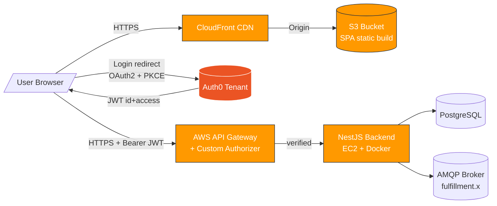
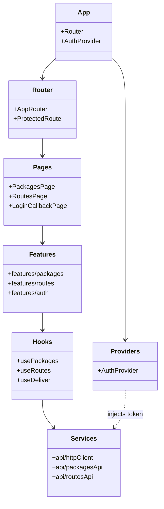

# CityExpress · Frontend G15 — Architecture E1

> Documento vivo. Toda decisión arquitectónica nueva exige un commit aquí + un AI log en `docs/prompts/`.

---

## 1. Vista de despliegue (alto nivel)



**Flujo de autenticación (RNF06/RNF07):**

1. Usuario abre la SPA → click "Login".
2. `@auth0/auth0-react` redirige a Auth0 (PKCE).
3. Auth0 redirige de vuelta con `code` → SDK lo intercambia por `accessToken` (audience del API) e `idToken`.
4. Cliente HTTP (fetch (httpClient.js)) inyecta `Authorization: Bearer <accessToken>` en cada request.
5. API Gateway Custom Authorizer valida el JWT contra el JWK endpoint público de Auth0 antes de llegar al backend.

---

## 2. Vista lógica — capas internas de la SPA



### Estructura de carpetas propuesta

```
src/
  main.jsx
  App.jsx
  router/
    AppRouter.jsx
    ProtectedRoute.jsx
  providers/
    AuthProvider.jsx
  pages/
    PackagesPage.jsx
    RoutesPage.jsx
    LoginCallbackPage.jsx
    NotFoundPage.jsx
  features/
    packages/
      PackagesList.jsx
      PackageRow.jsx
      PackageFilters.jsx
      DeliverButton.jsx
      isDeliverable.js
      usePackages.js
      useDeliver.js
    routes/
      RoutesTable.jsx
      RouteStatusBadge.jsx
      useRoutes.js
    auth/
      LoginButton.jsx
      LogoutButton.jsx
  components/
    Layout/
      Header.jsx
      Footer.jsx
      Layout.jsx
    feedback/
      Toast.jsx
      Spinner.jsx
      EmptyState.jsx
      ErrorState.jsx
  services/
    api/
      httpClient.js          # fetch + Bearer + timeout + HttpError
      packagesApi.js         # adapter packages endpoint
      routesApi.js           # adapter routes endpoint
  utils/
    datetime.js
    formatters.js
  config/
    env.js                   # lee/valida import.meta.env
__tests__/                   # tests unitarios (también colocados junto al archivo)
e2e/                         # tests Playwright
```

---

## 3. Mapeo RF → componentes

### RF-FE01 · Packages view

- **Page:** `src/pages/PackagesPage.jsx` — orquesta layout + filtros + lista + paginación.
- **Feature:** `src/features/packages/`
  - `PackagesList.jsx` — render de la tabla.
  - `PackageRow.jsx` — fila con todos los campos y `<DeliverButton>` embebido.
  - `PackageFilters.jsx` — formulario de filtros.
  - `usePackages.js` — hook que llama `packagesApi.list({page, filters})`, expone `{data, isLoading, error, refetch}`.
- **Service:** `src/services/api/packagesApi.js` — adapter del DTO backend → modelo de UI.

### RF-FE02 · Routes view

- **Page:** `src/pages/RoutesPage.jsx`.
- **Feature:** `src/features/routes/`
  - `RoutesTable.jsx` — tabla destinos.
  - `RouteStatusBadge.jsx` — badge `enabled/disabled`.
  - `useRoutes.js` — hook con refresh manual.
- **Service:** `src/services/api/routesApi.js`.

### RF-FE03 · Deliver action

- **Component:** `src/features/packages/DeliverButton.jsx`.
- **Pure function (testable):** `src/features/packages/isDeliverable.js`
  ```
  isDeliverable(pkg, now) → boolean
    return pkg.status !== 'delivered' && new Date(pkg.deliverNotBefore) <= now
  ```
- **Hook:** `src/features/packages/useDeliver.js` — `POST /packages/:id/deliver` con manejo 409/425.

### RF-FE04 / RF-FE05 · Auth & token

- **Provider:** `src/providers/AuthProvider.jsx` — wraps `<Auth0Provider domain audience clientId redirectUri>`.
- **Route guard:** `src/router/ProtectedRoute.jsx` — usa `useAuth0().isAuthenticated`; si `false` y no `isLoading`, llama `loginWithRedirect()`.
- **HTTP client:** `src/services/api/httpClient.js`
  - `request()` envuelve `fetch` con `baseURL = env.apiBaseUrl`, timeout via `AbortController` y serialización JSON.
  - `setTokenProvider(getAccessTokenSilently)` se llama desde `AuthProvider` en arranque; el header `Authorization: Bearer ${token}` se inyecta cuando hay provider.
  - 401 lanza `HttpError(status=401)` que el caller convierte en `logout({returnTo})`.

---

## 4. NFR mapping

| NFR                | Cómo se cubre                                                                                                 |
| ------------------ | ------------------------------------------------------------------------------------------------------------- |
| **Performance**    | Vite tree-shaking + `React.lazy`/`Suspense` por ruta · bundle visualizer en CI · CloudFront edge cache        |
| **Seguridad**      | Auth0 PKCE · Bearer JWT · HTTPS end-to-end · sin tokens en `localStorage` plano · CSP headers en nginx        |
| **Integrabilidad** | Capa adapter `services/api/*` aísla el shape del backend del modelo UI; cambios en DTOs no rompen componentes |
| **Mantenibilidad** | Feature folders + componentes puros + hooks testables · ESLint strict · Prettier · AI logs por sesión         |
| **Escalabilidad**  | S3 + CloudFront escalan trivialmente; SPA stateless · auth delegada a Auth0                                   |
| **Confiabilidad**  | Tests ≥75% · CI gate · 1 happy-path E2E · monitoreo New Relic Browser                                         |

---

## 5. Patrones aplicados

- **Provider/Context** — `AuthProvider` para estado de autenticación global.
- **Adapter** — `packagesApi.js` y `routesApi.js` traducen entre DTOs backend y modelos UI.
- **Strategy (light)** — `formatters.js` aplica formato distinto según `status` o `priorityClass`.
- **Container/Presentational** — pages orquestan, components son puros (props in, JSX out).
- **Guard pattern** — `ProtectedRoute` y `isDeliverable` como guardas explícitas y testables.

---

## 6. Decisiones y tradeoffs

| Decisión                            | Alternativa                     | Por qué la elegimos                                                                            |
| ----------------------------------- | ------------------------------- | ---------------------------------------------------------------------------------------------- |
| React Router v6                     | TanStack Router                 | Madurez, comunidad, equipo G15 ya familiar; TanStack mejor para typesafety pero usamos JS puro |
| Context + hooks (sin Redux/Zustand) | Zustand / Redux Toolkit         | Estado global mínimo en E1 (auth + datos por vista); abrir Zustand si crece                    |
| fetch (httpClient.js)               | Fetch nativo                    | Interceptors first-class para Bearer y manejo 401                                              |
| Vitest + RTL                        | Jest + RTL                      | Vitest comparte config con Vite, arranque más rápido                                           |
| Playwright                          | Cypress                         | Menor flakiness, multi-browser nativo, mejor DX en CI                                          |
| `@auth0/auth0-react`                | `oidc-client-ts` manual         | Oficial Auth0, ya maneja PKCE + token cache                                                    |
| Tailwind CSS                        | CSS Modules / styled-components | Velocidad de prototipado en E1; revisable post-E1                                              |
| S3 + CloudFront                     | Vercel / Netlify                | Requisito explícito del curso (RNF08)                                                          |
| Nginx en Docker (multi-stage)       | Servir directo desde S3         | Doble vía: contenedor para dev/prod parity (RNF01) + S3 para distribución pública              |

---

## 7. Riesgos arquitectónicos

- **Drift de DTOs backend↔frontend:** mitigado con adapters + revisión cross-repo en cada PR.
- **CORS misconfig:** validar en C1 con un endpoint smoke; documentar headers exactos en `README` deploy section.
- **Token leak vía logs:** ESLint rule custom + code review focus en interceptor.

---

## 8. Supuestos abiertos

- Auth0 se configura como **SPA application** con audience del API NestJS. _(Confirmar con backend lead)._
- API Gateway expone `/packages*` y `/routes` bajo el mismo subdominio `api.<dominio>`. _(Confirmar con DevOps)._
- New Relic Browser license key se entrega vía variable de entorno en build. _(Confirmar con curso)._
