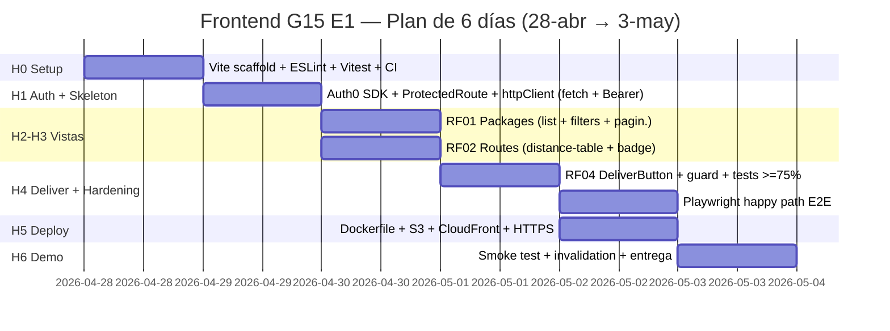

# CityExpress · Frontend G15 — Roadmap E1

> **Última actualización:** 2026-04-28
> **Deadline E1:** **domingo 2026-05-03 23:59 (CLT)** — quedan **5 días calendario**.
> **Owner:** Grupo 15 · **Repo backend (fuente de verdad):** `CityExpress-backendG15/`.

---

## 1. Visión

Construir una **Single Page Application** en **React + Vite (JavaScript puro)** que actúe como interfaz operativa del ecosistema CityExpress para el equipo G15. La SPA consume la API NestJS protegida por **AWS API Gateway** y se autentica vía **Auth0 (JWT/JWK)**. Despliegue obligatorio en **AWS S3 + CloudFront con HTTPS** (RNF08).

## 2. Objetivos E1

| #   | Objetivo                                                | RF/RNF cubiertos    | Métrica de éxito                                                                     |
| --- | ------------------------------------------------------- | ------------------- | ------------------------------------------------------------------------------------ |
| O1  | Vista operacional de paquetes recibidos                 | RF01                | Lista paginada con todos los campos del DTO + filtros básicos                        |
| O2  | Vista de estado de conectividad/rutas                   | RF02                | Tabla de destinos con `enabled` y `distance` actualizada al refrescar                |
| O3  | Acción "entregar paquete" respetando `deliverNotBefore` | RF04                | Botón deshabilitado si `now < deliverNotBefore`; sin doble entrega                   |
| O4  | Login/Logout y rutas protegidas                         | RNF06, RNF07        | Acceso a `/packages` y `/routes` solo con JWT válido; Bearer adjunto en cada request |
| O5  | Despliegue en producción                                | RNF01, RNF05, RNF08 | URL pública HTTPS sirviendo el build estático desde CloudFront                       |
| O6  | Calidad y verificabilidad                               | —                   | Coverage ≥75% (Vitest+RTL), 1 happy-path E2E (Playwright), CI verde                  |

## 3. Plan comprimido (5 días reales)

> **Restricción dura:** entrega el **domingo 2026-05-03**. Solo **6 días calendario** desde hoy. **Jueves 1 de mayo es feriado en Chile** (Día del Trabajador) → asumir productividad reducida.

| Hito                          | Día   | Fecha                           | Entregable                                                                                       | Definition of Done                                                                        |
| ----------------------------- | ----- | ------------------------------- | ------------------------------------------------------------------------------------------------ | ----------------------------------------------------------------------------------------- |
| **H0 · Setup**                | D0    | lun 28/04                       | Vite scaffolded, ESLint+Prettier+Vitest, GitHub Actions CI, branch protection, PR template       | `pnpm dev` corre en :5173, `pnpm test` pasa, CI verde en main                             |
| **H1 · Auth & Skeleton**      | D1    | mar 29/04                       | Auth0Provider, ProtectedRoute, layout, httpClient (fetch) + Bearer interceptor                   | Login/Logout funcional contra Auth0; redirección 401 → login                              |
| **H2 · RF01 Packages**        | D2    | mié 30/04                       | `/packages` con lista, paginación, filtros, estados loading/empty/error                          | Cubre RF01 completo; tests unitarios del hook y la vista; coverage módulo ≥75%            |
| **H3 · RF02 Routes**          | D2    | mié 30/04 (paralelo)            | `/routes` con tabla de conectividad                                                              | Cubre RF02; refresh manual; tests del adapter                                             |
| **H4 · RF04 Deliver + Tests** | D3-D4 | jue 1/05\* (feriado) → vie 2/05 | Botón "Entregar" con guard `deliverNotBefore` + Vitest coverage global ≥75% + 1 E2E happy path   | Sin doble entrega ni anticipada; CI publica reporte coverage; Playwright run en CI        |
| **H5 · Docker + Deploy**      | D5    | sáb 2/05                        | Dockerfile multi-stage, build subido a S3, distribución CloudFront, dominio `app.<dom>`          | URL HTTPS pública sirve la app; SPA fallback en 403/404 → `index.html`; ACM cert validado |
| **H6 · Smoke & Demo**         | D6    | dom 3/05                        | Invalidación CloudFront, smoke E2E contra producción, video demo (≤5min), PR final con changelog | Entrega formal antes de 23:59 CLT                                                         |

\*jueves 1/05 = feriado nacional. Capacidad reducida (~3-4h máx). Se asigna trabajo de bajo riesgo (escribir tests del guard `isDeliverable`, no integración).

## 4. Dependencias con el backend

> Coordinar diariamente con `CityExpress-backendG15/` siguiendo su plan comprimido (M1→M5 alineado al mismo deadline 2026-05-03).

- **Bloqueante D2 (RF01/RF02):** contratos `GET /packages`, `GET /routes` deben estar estables el **mié 30/04 AM**. Backend lo entrega en M3 (jue 30/04). **Mitigación:** mientras se finalizan, el frontend trabaja contra **MSW (Mock Service Worker)** con DTOs ficticios alineados a `requirements.md`.
- **Bloqueante D3 (RF04 deliver):** endpoint `POST /packages/:id/deliver` y Auth0 deben estar listos el **vie 2/05 AM**. Backend lo entrega en M4. **Mitigación:** el guard `isDeliverable` y los tests unitarios no necesitan backend; solo el E2E sí.
- **Bloqueante D5 (deploy):** API Gateway con CORS y dominio API en producción. **Mitigación:** mientras tanto, deploy del frontend apuntando a EC2 directo con CORS abierto en dev.

## 5. Riesgos y mitigaciones (ajustados al plan corto)

| Riesgo                                      | Probabilidad × impacto | Mitigación                                                                                            |
| ------------------------------------------- | ---------------------- | ----------------------------------------------------------------------------------------------------- |
| Atraso del backend en M3 (rutas/distancias) | Alta × Alto            | MSW activo desde D1; DTOs congelados en `requirements.md`                                             |
| Auth0 + API Gateway no integran a tiempo    | Media × Alto           | Si no está listo D5, **fallback** a deploy con auth deshabilitada en demo + slide explicando el flujo |
| Feriado del jueves 1/05                     | Alta × Medio           | Tareas de baja interdependencia ese día (tests, polish)                                               |
| ACM cert tarda >2h en validar               | Media × Alto           | Crear el cert el viernes 2/05 AM (no esperar al sábado)                                               |
| Costos AWS Free Tier                        | Baja × Medio           | CloudFront PriceClass_100, alertas budget (RNF03 backend)                                             |
| Drift DTOs backend↔frontend                 | Media × Alto           | Capa adapter `services/api/`; cross-review obligatorio entre repos en cada PR                         |
| Flakiness Playwright en CI                  | Media × Bajo           | Solo 1 happy path en E1; usuario Auth0 dedicado                                                       |

## 6. Métricas de seguimiento

- Coverage por PR (Vitest `--coverage`).
- Lighthouse Performance ≥ 80 en build de producción.
- Lead time por PR (objetivo: <12h con 2 reviewers — comprimido por deadline).
- AI logs por sesión presentes en `docs/prompts/`.

## 7. Política de relajación si el plan se atrasa >12h

Por orden de descarte (mantener siempre los Esenciales del enunciado):

1. **Descarte primero:** New Relic Browser (RNF09 NO esencial).
2. Después: Tailwind / polish UI (usar CSS plano).
3. Después: 2do filtro avanzado en RF01.
4. **NO descartable:** Auth0 (RNF06 Esencial), S3+CloudFront (RNF08 esencial parcial), tests ≥75% (regla curso), AI logs (regla curso, plagio si no se cumple).

## 8. Referencias cruzadas

- Requerimientos detallados: [`requirements.md`](./requirements.md)
- Ciclos día-a-día: [`milestones.md`](./milestones.md)
- Decisiones arquitectónicas y diagramas: [`architecture.md`](./architecture.md)
- Guía de despliegue: [`../README.md#11-despliegue-en-aws-rnf08`](../README.md)
- Backend pareado: [`../../CityExpress-backendG15/docs/roadmap.md`](../../CityExpress-backendG15/docs/roadmap.md)
